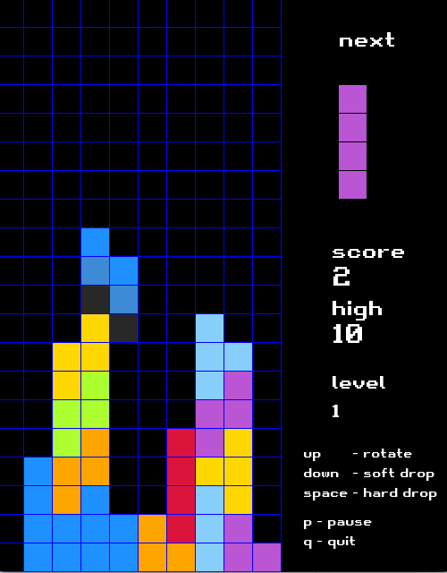

# Tetris in C++ and SFML

This is my first C++ project in around 10 years. My goal was to refresh some basic C++ skills by developing a simple game. I wanted to create a complete gaming experience rather than just bare gameplay, so I chose Tetris. Fun fact: despite spending countless hours playing Tetris in my childhood, I had never come across SRS logic before. I haven't fully implemented that system because I found some of its rules, such as the upward movement of tetrominos, awkward. In the end, the outcome is quite good as the game is fully playable, and the clearing lines effect is very satisfying, encouraging players to continue and strive for highscores.

Demo: [https://www.youtube.com/watch?v=hvzmkAFCNDk](https://www.youtube.com/watch?v=hvzmkAFCNDk)

# Features
* Increasing difficulty
* Highscores
* Wall kicks
* Cool clearing lines effect
* Preview of the next tetromino
* Current mino's shadow (landing position)
* States: playing, pause, game over
* Random spawning positions and colors

# Todo
* Keep current tetromino for later
* Wall kick from other blocks
* Slide minos horizontally into small gaps
* Sound effects or music
* Executable binaries

PS. I know... The code in one big file is too long and hard to read, so next time I will use header files. But for now, I will leave it as is so Copilot can learn some bad code ;-)
